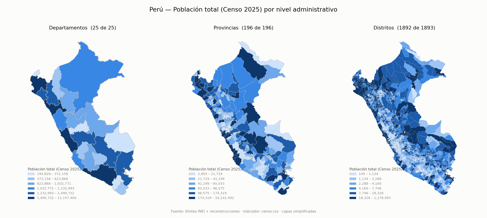

# Límites administrativos del Perú

Los 25 departamentos, 196 provincias y **1892 distritos** del Perú en GeoJSON y
GeoPackage, construidos con un pipeline reproducible y validado.

El INEI reconoce 1892 distritos en su registro oficial de ubigeos, pero su
servicio cartográfico sólo publica 1890. Faltan dos:

- **Santa Rosa de Loreto** (`160405`), creado el 2025‑07‑03 por la **Ley
  N.º 32403**. El Censo 2025 ya lo cuenta aparte (4 459 habitantes): hay datos
  censales para un distrito sin polígono.
- **Alto Trujillo** (`130112`), creado el 2022‑12‑15 por la **Ley N.º 31644**.

Ambos se reconstruyen **cortando el polígono de su distrito padre** y van
marcados como derivados. No tienen la misma calidad: Santa Rosa reusa arcos que
sí son el límite que describe su ley, mientras que Alto Trujillo tiene el límite
norte sustituido y va marcado `aproximado`.

> **Estos límites no son oficiales y son sólo para uso estadístico.** Sirven
> para agregar y mapear indicadores por unidad administrativa. No constituyen
> una demarcación territorial ni valen para deslindes, catastro, titulación ni
> ningún fin legal. Cada feature declara su procedencia para que se pueda
> filtrar lo reconstruido. Ver [Limitaciones](#limitaciones).

---

## Qué se publica

| archivo | features | tamaño | qué es |
|---|---|---|---|
| `salida/departamento.geojson` | 25 | 8.3 MB | polígonos de los 25 departamentos en GeoJSON, a resolución completa |
| `salida/provincia.geojson` | 196 | 18.2 MB | polígonos de las 196 provincias en GeoJSON, a resolución completa |
| `salida/distrito.geojson` | **1892** | 42.6 MB | polígonos de los 1892 distritos en GeoJSON, a resolución completa |
| `salida/*_simplificado.geojson` | 25 / 196 / 1892 | 1.8 / 4.1 / 10.8 MB | los mismos tres niveles simplificados a 100 m, para uso web; conservan la topología |
| `salida/peru_limites.gpkg` | 3 capas | 46.8 MB | los tres niveles a resolución completa en un único GeoPackage, para SIG de escritorio |
| `salida/ubigeos_2025.csv` | 2 113 filas | 0.3 MB | códigos y nombres oficiales de los tres niveles, con claves para cruzar por nombre |
| `salida/limites_lineas.geojson` | 5 600 arcos | 23.8 MB | los mismos límites como líneas, cada arco una sola vez, con los dos distritos que separa |

Y en [`ejemplos/`](ejemplos/), dos ejemplos ejecutables de consumo — un
coropleto en Python y un mapa web con Leaflet. Ver
[Cómo usar estos GeoJSON](#cómo-usar-estos-geojson).

GeoJSON en **EPSG:4326**, orden de ejes CRS84 (lon, lat), conforme a RFC 7946
(sin miembro `crs`). Un feature por línea, para que los diffs de git señalen
qué distrito cambió.

**Los ubigeos son del INEI.** RENIEC y SUNAT usan códigos distintos para los
mismos distritos; no son intercambiables.

## Qué es oficial y qué no

Se resuelve con un solo predicado:

```python
oficiales = [f for f in features if f['properties']['fuente'] == 'INEI']
```

| | `fuente` | `confianza` | features |
|---|---|---|---|
| Publicado por el INEI | `INEI` | `oficial` | 1890 |
| Reconstruido, fiel a su ley | `derivado` | `reconstruido` | 1 (`160405`) |
| Reconstruido, **aproximado** | `derivado` | `aproximado` | 1 (`130112`) |

**`reconstruido` y `aproximado` denotan calidades distintas y por eso no
comparten etiqueta.** En Santa Rosa de Loreto los arcos reusados **son** el
límite que describe su ley (41.8 m de discrepancia media) y todo lo nuevo
procede de sus 23 coordenadas. En Alto Trujillo el límite norte de la ley **no
existe** en la cartografía y se sustituyó por el arco del INEI, que corre unos
541 m fuera de sitio; se detalla [más abajo](#alto-trujillo-una-reconstrucción-aproximada-y-por-qué).

Ningún feature derivado va sin `ley_creacion`, `fecha_creacion`, `metodo` y
`advertencia`; la suite de validación lo exige. Las capas de provincia y
departamento son **íntegramente del INEI**: la creación de Santa Rosa es un
corte interno a la provincia 1604, así que no mueve ni un vértice de los
niveles superiores (se comprueba: la deriva de área de la provincia es de
0.026 m²).

## Ubigeos y nombres oficiales, cruzables con el Censo

`descargar_ubigeos.py` extrae el listado **oficial** de códigos y nombres del
[SISCONCODE](https://webapp.inei.gob.pe:8443/sisconcode/main.htm) del INEI y lo
deja en `salida/ubigeos_2025.csv` — 2 113 filas: **25 departamentos, 196
provincias y 1 892 distritos**.

```bash
python descargar_ubigeos.py                 # versión de config.yml (2025)
python descargar_ubigeos.py --version 2024  # otra versión de ubigeo
```

### Para cruzar con los tabulados del Censo 2025

Los tabulados del Censo **no traen ubigeo**: identifican las unidades por
nombre, como `PROVINCIA CHACHAPOYAS` o `DISTRITO ASUNCIÓN`. El CSV trae las
columnas para cerrar ese cruce:

| columna | ejemplo | para qué |
|---|---|---|
| `ubigeo` | `010102` | la clave real |
| `nombre` | `Asunción` | oficial, tal como lo publica el INEI |
| `nombre_censo` | `DISTRITO ASUNCIÓN` | **cruce directo con el Censo**, con tildes |
| `nombre_censo_normalizado` | `DISTRITO ASUNCION` | sin tildes, si la codificación viene rota |
| `clave_censo` | `AMAZONAS\|CHACHAPOYAS\|ASUNCION` | **la que debe usarse** |
| `nombre_normalizado` | `ASUNCION` | mayúsculas, sin tildes |
| `ubigeo_provincia`, `nombre_provincia`, `ubigeo_departamento`, `nombre_departamento` | | para reagrupar |

> **Cruce por `clave_censo`, no por `nombre_censo`.** Los nombres de distrito no
> son únicos en el Perú: **100 nombres se repiten y afectan a 257 distritos**
> (el 13.6 %). Hay 10 `DISTRITO SANTA ROSA`, 6 `SAN ANTONIO`, 5 `SANTA CRUZ`.
> Un merge por nombre suelto multiplica filas en silencio. `clave_censo` lleva
> departamento y provincia incorporados y es **única en los 1 892 distritos**,
> las 196 provincias y los 25 departamentos.

Al leer los tabulados, construya la misma clave arrastrando el departamento y
la provincia de las cabeceras del cuadro, normalice con la misma función
(mayúsculas, sin tildes, espacios colapsados) y cruce por ahí.

### El registro oficial y la cartografía no coinciden

| | departamentos | provincias | distritos |
|---|---|---|---|
| SISCONCODE (registro oficial) | 25 | 196 | **1 892** |
| WFS del INEI (cartografía) | 25 | 196 | **1 890** |
| esta publicación | 25 | 196 | **1 892** |

Al WFS le faltan **dos** polígonos; ambos se reconstruyen aquí:

- **`160405` Santa Rosa de Loreto** — Ley 32403. Fiel a su memoria descriptiva:
  `confianza: reconstruido`.
- **`130112` Alto Trujillo** — Ley 31644. Su límite norte no procede de la ley:
  `confianza: aproximado`.

`sin_cartografia` en `config.yml` queda vacío, y la suite de validación falla si
aparece un distrito oficial nuevo sin polígono.

**Los códigos no son predicciones.** El SISCONCODE registra
`160405 Santa Rosa de Loreto` y `130112 Alto Trujillo`, exactamente lo que
calcula la regla `max + 1` en ambos casos. El build los sigue calculando con la
regla y los compara contra los oficiales: si dejaran de coincidir, se detiene.
Por eso los features salen con `ubigeo_provisional: false` aunque su geometría
sea derivada: el código y la geometría son dos cosas distintas.

> Los tabulados del Censo no se descargan automáticamente: su catálogo
> (`multiproyecto.inei.gob.pe/api/v1/catalogo`) devuelve **HTTP 500** y el
> servidor de archivos no permite listar directorios. Las columnas de cruce
> siguen el formato documentado del Censo, pero **no se han verificado contra
> los archivos reales**.

## Método de simplificación

Las variantes `*_simplificado.geojson` se generan con **mapshaper**, que
construye primero la topología de arcos compartidos y simplifica cada límite
**una sola vez**. Eso es lo que mantiene a los distritos vecinos encajados: el
borde que comparten se mueve igual en los dos, no por separado.

Parámetros, en `config.yml`:

```yaml
simplificacion:
  herramienta: mapshaper
  metodo: weighted        # Visvalingam ponderado, el de mapshaper por defecto
  intervalo_m: 100        # en lon/lat mapshaper interpreta el intervalo en metros
```

100 m es indistinguible por encima de ~1:250 000, que es la escala a la que se
usan estas capas en web. Verificado sobre la salida publicada:

| | pares solapados | agujeros | área de agujeros | desviación vs completa |
|---|---|---|---|---|
| resolución completa | 0 | 8 (lagos) | 615.0 km² | — |
| **simplificada** | **0** | **8 (lagos)** | **615.1 km²** | **1 992 km² (0.155 %)** |

Cero solapes nuevos y los mismos 8 agujeros —los lagos que el INEI deja fuera
de la cobertura—, así que la capa simplificada conserva la topología y sirve
para agregar, no sólo para dibujar. El precio es tamaño: conservar los vértices
de los bordes compartidos deja el GeoJSON de distritos en 10.8 MB.

Cada nivel se simplifica **por separado**. Procesar los tres juntos con
`combine-files` comparte la topología entre niveles, pero como el polígono de
una provincia ocupa el mismo espacio que sus distritos, mapshaper reporta
intersecciones que no puede reparar.

> mapshaper avisa de *«1 intersection could not be repaired»* en departamento y
> provincia. **No lo provoca este paso**: el mismo aviso sale con `interval=1`,
> es decir sin simplificar nada, y ese par solapado también está en la
> resolución completa. Viene en la cartografía del INEI. El nivel de distrito,
> que es el que reconstruimos, no lo tiene a ningún intervalo.

## Reproducir el build

Requiere **Python 3.11** y **Node.js** (para mapshaper).

```bash
pip install -r requirements.txt
npm install -g mapshaper        # la simplificación lo necesita

python descargar.py      # baja las 3 capas del INEI a fuentes/ (~80 MB)
python descargar_ubigeos.py   # listado oficial de ubigeos y nombres (CSV)
python construir.py      # arma los 3 niveles en salida/ + QA en qa/
python publicar.py       # simplificada (mapshaper) + GeoPackage
python lineas.py         # los límites como líneas (opcional)
python -m pytest -q      # suite de validación (51 tests, ~3 min)
python mapa_qa.py        # PNG antes/después de la provincia tocada
```

`fuentes/` no se versiona (pesa demasiado y es reproducible). Todo lo demás sí.

En Windows, si `python` abre la Microsoft Store, use `py -3.11`.

---

## Cómo usar estos GeoJSON

### Mapa interactivo

**[▶ Abrir el mapa](https://rodasluis.github.io/Peru-maps/ejemplos/mapa_web.html)**

Filtra por **nivel** (los tres a la vez, o uno a pantalla completa) y por
**población** (total, hombres, mujeres), con tooltip, leyenda por nivel, vista
de tabla y tema claro/oscuro.

[](https://rodasluis.github.io/Peru-maps/ejemplos/mapa_web.html)

Para ejecutarlo en local, `fetch()` sobre `file://` está bloqueado por el
navegador, así que hace falta un servidor:

```bash
python -m http.server 8000
# http://localhost:8000/ejemplos/mapa_web.html
```

### Generar los mapas

```bash
python ejemplos/cargar_censo.py                        # descarga y cruza el censo
python ejemplos/mapa_python.py                         # los tres niveles
python ejemplos/mapa_python.py --nivel distrito --medida mujer
```

`mapa_python.py` escribe el PNG y `ejemplos/datos/indicador.json`, que es lo que
consume el mapa web: un solo sitio decide qué se mapea. En ausencia de
`ejemplos/datos/censo.csv`, ambos ejemplos mapean el **área en km²** calculada
de la geometría.

Los ejemplos leen las capas **simplificadas** (1.8 / 4.1 / 10.8 MB en vez de
8.3 / 18.2 / 42.6 MB) y calculan **6 clases por cuantiles propias de cada nivel
y medida**: las distribuciones no son comparables entre sí, y reutilizar los
cortes de un nivel en otro dejaría el mapa distrital casi monocromo.

### Python — coropleto con geopandas

`ubigeo` es la clave para todo. Un `merge` y ya:

```python
import geopandas as gpd
import pandas as pd

distritos = gpd.read_file('salida/distrito_simplificado.geojson')
datos = pd.read_csv('mi_indicador.csv', dtype={'ubigeo': str})   # ¡dtype=str!
gdf = distritos.merge(datos, on='ubigeo', how='left')

# El área SIEMPRE en un CRS proyectado, nunca en grados.
gdf['area_km2'] = gdf.to_crs('ESRI:102033').area / 1e6
gdf['densidad'] = gdf['poblacion'] / gdf['area_km2']

gdf.plot(column='densidad', scheme='quantiles', k=6, cmap='Blues',
         edgecolor='#c3c2b7', linewidth=0.12, legend=True)
```

> **`dtype={'ubigeo': str}` no es opcional.** Si pandas lee los ubigeos como
> números, `010101` se convierte en `10101` y el `merge` falla en silencio para
> todo Amazonas, Áncash y Apurímac — los 25 departamentos con cero inicial.

Agrupar hacia arriba es cortar el código, porque la jerarquía está en el propio
ubigeo:

```python
gdf['ubigeo_provincia'] = gdf['ubigeo'].str[:4]      # o use la columna ya incluida
por_provincia = gdf.groupby('ubigeo_provincia')['poblacion'].sum()
```

Y quedarse sólo con lo oficial es un predicado:

```python
oficiales = gdf[gdf['fuente'] == 'INEI']             # excluye los 2 derivados
```

### HTML — mapa web con Leaflet

[`ejemplos/mapa_web.html`](ejemplos/mapa_web.html) es un solo archivo, sin build
ni dependencias más allá de Leaflet. Lo esencial:

```js
const vals = indicador.medidas[medida].valores[nivel];   // total | hombre | mujer

L.geoJSON(geo[nivel], {
  style: f => ({
    fillColor: color(vals[f.properties.ubigeo], cortes),
    fillOpacity: 0.9,
    color: '#c3c2b7', weight: 0.18,             // borde hairline y muy fino
  }),
  onEachFeature: (f, lyr) => lyr.bindTooltip(
    `<b>${f.properties.nombre}</b>` +
    `<span>${f.properties.nombre_departamento}</span>` +
    `<span>${f.properties.ubigeo} · ${fmt(vals[f.properties.ubigeo])} hab.</span>`,
    { sticky: true }),
}).addTo(mapa);
```

El indicador lo produce `mapa_python.py` en `ejemplos/datos/indicador.json`
(111 KB: tres medidas por tres niveles), de modo que cambiar de filtro no vuelve
a pedir datos.

### Datos de ejemplo

Los ejemplos usan la población de los Censos Nacionales 2025, ya cruzada con el
ubigeo en [`ejemplos/datos/censo.csv`](ejemplos/datos/censo.csv):
2113 filas con `total`, `hombre` y `mujer` para los tres niveles.

[`cargar_censo.py`](ejemplos/cargar_censo.py) la descarga del INEI y hace el
cruce. El cruce está completo y verificado —25 / 196 / 1892, y la suma de los
distritos da exactamente el total nacional publicado—; el script documenta las
particularidades del tabulado y emite un informe de cobertura en cada corrida.

> **Se cruza por `clave_censo`, no por nombre.** Ver
> [la sección de ubigeos](#ubigeos-y-nombres-oficiales-cruzables-con-el-censo):
> 100 nombres de distrito se repiten y afectan a 257 distritos.

---

## Método: cómo se reconstruyó Santa Rosa

### Principio del método

**Nunca se dibuja un límite desde cero.** El perímetro de Santa Rosa es casi
todo frontera internacional y cauces de río que la cartografía del INEI ya
tiene digitalizados. Digitalizar de nuevo esas líneas a partir de la lista de
coordenadas de la ley produciría un polígono que no encaja con sus vecinos.

### Es un corte de un solo padre

La memoria descriptiva (art. 3.1) describe el límite norte como *«límite con el
distrito de Ramón Castilla»*. Pero ese arco **ya existe**: los 10 puntos de
referencia del thalweg del Brazo Yahuma caen a **15.8–83.4 m (media 41.8 m)**
del arco 160401/160403 que el INEI publica. Es el límite preexistente
reformulado, no uno nuevo.

Por eso **Santa Rosa sale íntegramente de Yavarí (160403) y Ramón Castilla no
se toca** — comprobado: la intersección del polígono resultante con 160401 es
0 km².

### Qué se reusa y qué se construye

```
  N  ┌──────── Brazo Yahuma ────────┐          REUSADO   arco INEI 160401/160403
  W  │ río Callarú                  │ E        REUSADO   arco INEI 160401/160403
     │                              │ frontera REUSADO   borde INEI (tratados
     │                              │                    CO 1922 / BR 1851)
     └── línea quebrada (23 pts) ───┘          CONSTRUIDO  coords. de la ley
  S            paralelo N=9 527 007            CONSTRUIDO  2 613 m
```

La cobertura de coordenadas de la memoria es muy desigual, y eso decide el
diseño:

| tramo | qué dice la ley | puntos dados |
|---|---|---|
| Norte (Brazo Yahuma) | *thalweg* | 10, marcados **«de referencia»** |
| Este | frontera, *según tratados* | **0** |
| Oeste (río Callarú) | *thalweg*, aguas abajo | **0 — sólo los extremos** |
| Sur/SO | ***línea quebrada*** | **23, explícitos** |

El río Callarú y la frontera no se pueden dibujar desde la ley: no trae
coordenadas. Y sólo las *líneas quebradas* son tramos rectos por definición
legal, así que unir sus puntos con segmentos es exacto, no una aproximación.

### El corte, paso a paso

Una sola línea de corte, con los dos extremos sobre el borde de Yavarí:

1. Arranca en `(367 725, 9 545 099)` — desembocadura de una quebrada sin
   nombre en el Callarú, a 3.9 m del borde de Yavarí.
2. Los 23 puntos de la memoria como segmentos rectos.
3. Desde `(391 999, 9 527 007)` hacia el este por el paralelo hasta salir del
   polígono, lo que ocurre en **E = 394 612** (2 613 m al este).
4. `split(Yavarí, línea)` → 2 piezas. La que contiene el pueblo de Santa Rosa
   (capital según el art. 2) es el distrito nuevo.

| | km² |
|---|---|
| Yavarí antes | 14 371.3118 |
| Yavarí después | 14 121.5585 |
| **Santa Rosa (`160405`)** | **249.7533** |
| deriva de área | 0.00027 m² |

Cortar un polígono por una línea conserva el área a precisión de coma flotante,
así que la conservación es exacta por construcción y no una negociación de
tolerancias. La tolerancia configurada (1 m²) queda cuatro órdenes de magnitud
por encima de la deriva real.

### Decisiones sobre tramos ambiguos

**El tramo norte (16–83 m de discrepancia).** Se reusa el arco del INEI. La ley
llama a esas coordenadas «de referencia» y define el límite como *el thalweg*,
que el arco del INEI ya representa; la discrepancia es ruido de generalización
cartográfica. Usar los puntos de la memoria obligaría a modificar también
Ramón Castilla y abriría una franja en disputa entre ambos distritos. La
medición queda publicada en `qa/reporte.json`, no escondida en el código.

**«Por el paralelo».** Un paralelo geográfico y una línea de *northing* UTM
constante no son la misma línea. Se midió la diferencia: **4–5 m** en estos
tramos, un orden de magnitud por debajo de los 42 m de ruido cartográfico. Se
toma northing constante, que es como la memoria expresa las coordenadas
(art. 3.2).

**CRS de la memoria.** Confirmado en el PDF, no supuesto: el art. 3.2 dice
*«Zona 19 Sur, Datum WGS84, Sistema de Proyección UTM»* → **EPSG:32719**. El
punto de control `391 999 E / 9 527 007 N` reproyecta a 69.973° O, 4.279° S,
dentro del área esperada.

**El corte opera sobre la geometría original en EPSG:4326**, no sobre una
reproyectada de ida y vuelta. Dar el viaje 4326 → UTM → 4326 mueve los vértices
lo justo para despegar el borde que Yavarí comparte con vecinos ajenos al corte:
se midió que introducía **5 solapes por 91 m²** con distritos como 160105 y
160511, que la fuente del INEI no tiene. La línea sí se construye en UTM (donde
«recto» significa recto) y se densifica cada 50 m antes de reproyectarla.

---

## Alto Trujillo: una reconstrucción aproximada, y por qué

`130112 Alto Trujillo` (Ley 31644, provincia de Trujillo, La Libertad) se
reconstruye cortando **El Porvenir (130102)**, pero **no tiene la misma calidad
que Santa Rosa** y se publica marcado `confianza: aproximado`.

La memoria (art. 3) describe el límite contra **cuatro** vecinos. Sólo el tramo
con El Porvenir y el de Florencia de Mora llegan con coordenadas utilizables
(**6 puntos**); los otros dos se reusan de los arcos que el INEI ya publica,
porque la ley los declara límites con esos distritos:

| tramo | de dónde sale | discrepancia con la ley |
|---|---|---|
| **El Porvenir** (E, SE) | 6 coordenadas de la ley | — |
| **Huanchaco** (N) | arco INEI, **sustituido** | **541.4 m** (1 solo punto en la ley) |
| **La Esperanza** (O) | arco INEI, **sustituido** | 57.7–421.9 m (media 329.5) |
| Florencia de Mora (S) | coordenadas de la ley | ver más abajo |

Todo el límite norte —cumbre del cerro Cabras (cota 655), un cerro sin nombre
(cota 430), la divisoria de aguas entre la quebrada San Ildefonso y las
quebradas Río Seco y León, y la cumbre sureste del cerro El Alto (cota 1015)—
se describe con **un solo par de coordenadas**: 717 365 E, 9 109 924 N. Y ese
punto **no cae sobre ningún arco existente**: está a 541 m, dentro de Huanchaco.
Al revés que en Santa Rosa, aquí el arco del INEI **no es** el límite que
describe la ley.

Resultado: **17.380 km²** para Alto Trujillo y 21.011 km² para El Porvenir, de
los 38.391 km² originales; el área se conserva exactamente (2.2 × 10⁻³ m² de
deriva). **El distrito real es mayor por el norte.** No sirve para deslindes.

### Por qué los tramos con vecinos se reusan y no se trazan

La primera versión trazó los límites con La Esperanza y Florencia de Mora con
las coordenadas de la memoria, que caen **por dentro** de El Porvenir. Eso
dejaba una franja de El Porvenir de entre 58 y 422 m **entre Alto Trujillo y
La Esperanza**, cuando la propia ley dice que son vecinos.

Corregido: donde la ley declara el límite con un distrito que no es el padre,
se reusa el arco existente con ese distrito. Alto Trujillo y La Esperanza
**comparten ahora 2.05 km** de frontera. Adyacencias publicadas:

| vecino | frontera compartida |
|---|---|
| El Porvenir | 10.04 km |
| Huanchaco | 6.60 km |
| La Esperanza | 2.05 km |
| **Florencia de Mora** | **0 — quedan 415 m de El Porvenir en medio** |

Para hacerlo bien haría falta digitalizar el **Anexo 1** de la ley —que es un
mapa 1:25 000 en WGS84 / UTM 17S con la grilla rotulada y el límite dibujado— o
resolver las cumbres y la divisoria de aguas con un modelo de elevación.

La discrepancia va medida y publicada en `qa/reporte.json` como un tramo de
tipo `sustituido`, y la suite exige que todo distrito con un tramo así salga
marcado `aproximado` y con advertencia.

## Asignación de ubigeo

```
nuevo = provincia + zfill(max(códigos distritales de la provincia) + 1, 2)
```

**`max + 1`, nunca `count + 1`.** Las secuencias provinciales tienen huecos:
cuando se crea una provincia, los distritos que se mudan conservan su código y
el INEI deja el hueco en vez de renumerar — eso es lo que protege las series
históricas.

Verificado contra la capa del INEI: Alto Amazonas (`1602`) tiene
`160201 160202 160205 160206 160210 160211`, con huecos en 03, 04, 07, 08 y 09.
`count + 1` emitiría **`160207`**, un código retirado de un distrito que pasó a
Datem del Marañón: una colisión que corrompería en silencio cualquier join
contra datos anteriores a 2005. Maynas (`1601`) tiene huecos en 09 y 11.

Para Santa Rosa la regla da **`160405`** (Mariscal Ramón Castilla es `1604`, con
`160401` Ramón Castilla, `160402` Pebas, `160403` Yavarí, `160404` San Pablo).
Se calcula contra los datos, no está escrito a mano.

**Es una predicción de lo que asignará el INEI, no una autoridad.** Va marcado
`ubigeo_provisional: true` en las propiedades, se puede fijar a mano en
`leyes/registro.yml`, y `vigilar_inei.py` lo compara con el código oficial en
cuanto el INEI publique el distrito.

Guards implementados (`ubigeo.py`), que fallan en vez de emitir un código
dudoso: la secuencia no pasa de `99`; el código no está en uso; el código no
está en la blocklist de retirados. Ver la limitación sobre esa blocklist más
abajo.

## Esquema de propiedades

Todo feature distrital lleva:

```
ubigeo, nombre, ubigeo_provincia, nombre_provincia,
ubigeo_departamento, nombre_departamento,
fuente              "INEI" | "derivado"
ley_creacion        "32403"  |  null para lo del INEI
fecha_creacion, metodo, confianza, ubigeo_provisional, advertencia
```

Los campos originales del INEI se conservan **sin renombrar**: `ccdd`, `ccpp`,
`ccdi`, `nombdist`, `periodo`, `ccdd_c`, `ccpp_c`, `ccdi_c`, `fec_reg`.

Dos normalizaciones, ambas forzadas:

| origen INEI | aquí | por qué |
|---|---|---|
| `fuente` | **`fuente_inei`** | colisión: el esquema necesita `fuente` para la procedencia. El valor del INEI (`"V Censo Nacional Economico"`) se conserva íntegro bajo el nombre nuevo. |
| — | **`ubigeo`** en provincia | `ig_provincia` **no publica** ubigeo de 4 dígitos: sólo `ccdd` y `ccpp` sueltos. Se concatena. Igual en departamento (`ccdd`). |

`fid` y `objectid` se descartan: son identificadores de fila de GeoServer, no
atributos del distrito, y no son estables entre descargas.

---

## Suite de validación

51 tests que rompen el build ante cualquier violación. Las capas se construyen
en local y su resultado se versiona; en CI se valida ese resultado, sin
descargar nada del INEI.

- **conteos** 1892 / 196 / 25, leídos de `config.yml`, no literales
- **ubigeos** únicos y bien formados (6 / 4 / 2 dígitos, con cero a la izquierda)
- **jerarquía de códigos** cierra en ambos sentidos entre los tres niveles
- **nombres** de provincia y departamento resueltos contra sus capas
- **procedencia** en todo feature; un solo predicado separa lo oficial
- **geometrías** válidas, no vacías, sin autointersecciones
- **sin solapes** entre distritos por encima de 1 m²
- **cierre geométrico** distrito→provincia→departamento y contra el límite nacional
- **conservación de área** del corte, medida contra `fuentes/` y no contra el
  reporte del propio build
- **CRS** de salida EPSG:4326; toda área y longitud se calcula en un CRS
  proyectado equivalente‑área (`ESRI:102033`), nunca en grados
- **byte‑estabilidad**: la reconstrucción compara byte a byte contra la corrida
  anterior

La tolerancia de conservación de área **no es una constante**: se deriva como
`perímetro × tamaño de celda`. Publicar con precisión de 1.1 cm mueve cada
vértice hasta media celda, así que un polígono de borde fluvial larguísimo como
Yavarí cambia de área del orden de ese producto (observado: 3 032 m² sobre
14 371 km², 2.1 × 10⁻⁷ en relativo). Derivarla hace que escale sola para el
próximo distrito.

---

## Limitaciones

**Incoherencias que vienen del INEI.** En **7 provincias**, la unión de los
distritos que el propio INEI publica no reproduce el polígono provincial que el
propio INEI publica, con diferencias de hasta **279 km²**:

| provincia | diferencia |
|---|---|
| 1403 | 279.16 km² |
| 2008 | 116.32 km² |
| 2003 | 110.08 km² |
| 2004 | 52.76 km² |
| 0102 | 47.30 km² |
| 0608 | 42.94 km² |
| 0609 | 4.36 km² |

Se midieron sobre `fuentes/` recién descargado, sin pasar por este pipeline, y
salen idénticas: **no las introduce el build**. Están listadas en `config.yml`
y se remiden en cada corrida (`qa/incoherencias_inei.json`). La suite falla si
aparece una **nueva**. Se enumeran una a una en lugar de subir la tolerancia a
300 km², que las volvería indetectables.

**Hay ~615 km² que no pertenecen a ningún distrito.** Los límites distritales
encierran seis cuerpos de agua que el INEI deja fuera de la cobertura:

| cuerpo de agua | km² | rodeado por |
|---|---|---|
| Lago Junín (Chinchaycocha) | 269.02 | Junín, Carhuamayo, Ondores, Ninacaca, Vicco |
| Laguna Arapa | 133.25 | Arapa, Chupa, Samán, Huancané |
| Laguna Parinacochas | 67.39 | Pullo, Puyusca |
| Laguna de Salinas | 61.65 | San Juan de Tarucani |
| Laguna Langui‑Layo | 54.08 | Kunturkanki, Langui, Layo |
| Laguna Umayo | 29.62 | Atuncolla, Paucarcolla, Tiquillaca, Vilque |

Están en la fuente y no las introduce el build. La suite comprueba el total
para detectar un hueco **nuevo**, que sí sería un error. Sólo dos de ellas
(Salinas y una en Sullana) vienen declaradas como anillo interior en el
polígono; las demás sólo existen como espacio no cubierto.

**Slivers degenerados en los nodos.** Donde se juntan tres o más límites quedan
micro‑caras sin dueño: cada corte deja una o dos donde su línea se encuentra con
el arco existente. Hoy suman **3 caras y 0.123 m² en total** — Santa Rosa
0.024 m², Alto Trujillo 0.093 y 0.006 m² —, del orden de un par de celdas de la
grilla de publicación de 1.1 cm. La fuente del INEI ya trae las suyas.

Se acota el **área total** (`< 10 m²`) y no el número: así la cota no hay que
subirla cada vez que se añade un distrito, y un hueco de verdad —que sería miles
de veces mayor— sigue rompiendo el build.

**Sólo se contemplan distritos nuevos.** En la práctica sólo se crean distritos.
No hay maquinaria para provincias ni departamentos nuevos; si eso pasara, habría
que extender el pipeline, no sólo el registro.

**La blocklist de códigos retirados está vacía.** El guard está implementado y
cableado a `ubigeos_retirados.csv`, pero sin las tablas históricas del INEI que
lo alimenten. Es una desviación deliberada: `max + 1` **nunca cae en un hueco**
(los huecos están por debajo del máximo por definición), así que cubre por
completo el caso `160207` de Alto Amazonas. Queda expuesto sólo si se retiró un
código **por encima** del máximo actual — p. ej. Maynas está en max=13, así que
`160114` colisionaría si alguna vez existió un `160114` que se mudó. Dejar caer
las tablas en ese CSV (`ubigeo,anio_retiro,motivo,fuente`) activa el guard solo.

**El GeoPackage no es byte‑estable**: SQLite embebe metadatos propios. La
garantía de estabilidad es sólo para los GeoJSON.

**Frontera en controversia.** Ver el aviso del encabezado. El polígono hereda la
línea fronteriza del INEI sin reinterpretarla.

---

## Incorporar un distrito de creación reciente

Un distrito nuevo se incorpora con una entrada en el registro de leyes y una
corrida del pipeline, sin modificar el código. Santa Rosa de Loreto y Alto
Trujillo se incorporaron por esta vía.

El procedimiento:

1. El PDF de la ley va en `leyes/`, con nombre en ASCII (`ley-32999.pdf`).
2. Se añade una entrada en `leyes/registro.yml` con nombre, ley, fechas,
   provincia, `padre` y el bloque `corte` con los puntos de la memoria
   descriptiva en su CRS. Con `ubigeo: null` el código lo calcula la regla
   `max + 1`.
   - `punto_interior` debe caer claramente dentro del distrito nuevo; la
     capital suele servir. El build falla si no cae en exactamente una pieza.
   - Si el INEI ya asignó el código —se comprueba con `descargar_ubigeos.py`—
     va en `ubigeo_oficial_confirmado`. La regla lo sigue calculando y el build
     compara ambos: si difieren, se detiene.
   - `confianza` es `reconstruido` sólo si los arcos reusados **son** el límite
     que describe la ley y todo lo nuevo sale de sus coordenadas. Si algún
     tramo se sustituye o se construye, es `aproximado` y exige `advertencia`.
   - Los tramos que la memoria describe pero que ya existen en la cartografía
     van en `verificacion_tramos_reusados`, con `tipo: coincidente` o
     `tipo: sustituido`. No entran en la geometría: sólo se mide y publica su
     discrepancia. Un tramo `sustituido` obliga a `confianza: aproximado`.
3. Se actualiza el conteo de `distrito` en `config.yml`, y se retira el
   distrito de `sin_cartografia` si estaba declarado ahí.
4. Se reconstruye y valida:
   `python construir.py && python publicar.py && python lineas.py && python -m pytest -q`
5. Se revisa `qa/<provincia>_antes_despues.png` y el diff de `salida/` antes de
   versionar el resultado.

**La revisión visual del paso 5 es obligatoria.** Decidir qué arcos se reusan
exige leer la memoria descriptiva, y ninguna validación automática cubre ese
juicio. Alto Trujillo lo ilustra: trazar los tramos que la ley declara límite
con La Esperanza dejaba una franja de El Porvenir entre dos distritos que la
propia ley declara vecinos, y ese error sólo se detecta mirando el mapa.

El build sí se detiene por sí solo ante geometría dudosa: falla si la línea de
corte no cruza el borde, si el punto interior cae en 0 o 2 piezas, si el área no
se conserva, o si la prolongación cruza el borde más de una vez.

`vigilar_inei.py` consulta el WFS y el SISCONCODE y avisa cuando el INEI publica
finalmente un distrito suplido, incluso si el ubigeo oficial difiere del
predicho. Esa es la señal para retirar la entrada del registro: el polígono
oficial reemplaza a la reconstrucción.

**No se incluye un scraper de El Peruano, por diseño.** Detectar la publicación
de una ley es útil como aviso, pero un distrito no debe entrar en los datos
publicados sin que una persona revise su geometría.

---

## Cómo citar

[](https://doi.org/10.5281/zenodo.21755886)

> Rodas, L. (2026). *Límites administrativos del Perú: 1892 distritos, con los
> distritos de creación reciente reconstruidos a partir de sus leyes*
> \[conjunto de datos]. Zenodo. https://doi.org/10.5281/zenodo.21755886

```bibtex
@dataset{rodas_limites_peru,
  author    = {Rodas, Luis},
  title     = {Límites administrativos del Perú: 1892 distritos, con los
               distritos de creación reciente reconstruidos a partir de sus leyes},
  year      = {2026},
  publisher = {Zenodo},
  doi       = {10.5281/zenodo.21755886},
  url       = {https://doi.org/10.5281/zenodo.21755886}
}
```

**Cite la versión, no `main`.** Estos datos cambian: cuando el INEI publique
Santa Rosa de Loreto o Alto Trujillo, sus polígonos reconstruidos se retiran en
favor de los oficiales, y la reconstrucción aproximada de Alto Trujillo puede
mejorar. Zenodo emite un DOI **de versión**, que apunta a un release concreto y
es el reproducible, y uno **de concepto**, que siempre resuelve a la última
versión. Para un trabajo publicado corresponde el de versión.

**Cite también la fuente.** El DOI acredita la reconstrucción y el pipeline, no
la cartografía de origen, que es del INEI (ver [Fuentes](#fuentes)).

Los metadatos de citación están en [`CITATION.cff`](CITATION.cff).

---

## Licencia

El **código** se publica bajo licencia MIT (`LICENSE`).

Los **datos** derivan de las capas que el INEI publica en su GeoServer
«Interoperabilidad», **de uso público**. Las geometrías de Santa Rosa de Loreto
y Alto Trujillo son obra derivada de esas capas más las Leyes N.º 32403 y
N.º 31644.

Atribución mínima al reutilizar: **INEI** por la cartografía de origen, y este
repositorio por la reconstrucción de los dos distritos derivados y por el
pipeline.

## Fuentes

- INEI, GeoServer «Interoperabilidad» — `ig_departamento`, `ig_provincia`,
  `ig_distrito` — <https://geoespacial.inei.gob.pe/geoserver/Interoperabilidad/ows>
- INEI, **SISCONCODE** (Sistema de Consulta de Códigos Estandarizados), versión
  de ubigeo 2025 — <https://webapp.inei.gob.pe:8443/sisconcode/main.htm>
- INEI, **Censos Nacionales 2025** — *Indicadores demográficos*, cuadro
  INDDEM06 (población total, censada y omitida por departamento, provincia y
  distrito). Usado sólo en los ejemplos.
  [xlsx](https://sistemas.inei.gob.pe/dir-segmentacion-ci/postcensal/prod/adjuntos/censos-2025/descarga_datos/tabulados/00/poblacion/Indicadores_demogr%C3%A1ficos.xlsx)
- **Ley N.º 32403**, *Ley de creación del distrito de Santa Rosa de Loreto en la
  provincia de Mariscal Ramón Castilla del departamento de Loreto*, El Peruano,
  3 de julio de 2025 (`leyes/ley-32403.pdf`).
  - Cartografía básica que cita: IGN (2024), *Islandia* 1:100 000, serie J631
    hoja 2862 (9‑v); *Isla Chinería* 1:100 000, serie J631 hoja 2962 (9‑x).
  - Tratados del tramo fronterizo: Tratado de Límites y Libre Navegación
    Fluvial Perú‑Colombia (Lima, 24‑03‑1922); Convención Fluvial sobre Comercio
    y Navegación Perú‑Brasil (Lima, 23‑10‑1851).
- **Ley N.º 31644**, *Ley de creación del distrito de Alto Trujillo en la
  provincia de Trujillo del departamento de La Libertad*, El Peruano,
  15 de diciembre de 2022 (`leyes/ley-31644.pdf`).
  - Cartografía básica que cita: IGN (s/f), *Trujillo* 1:100 000, serie J631
    hoja 1054 (17‑e); *Salaverry* 1:100 000, serie J631 hoja 1154 (17‑f);
    Municipalidad Provincial de Trujillo (2020), *Plano Base Trujillo
    Metropolitano* 1:10 000, plano n.º 02.
  - Su **Anexo 1** trae la representación cartográfica del límite a 1:25 000
    (WGS84 / UTM 17S, con grilla rotulada). **No se digitalizó**; ver la sección
    de Alto Trujillo.
